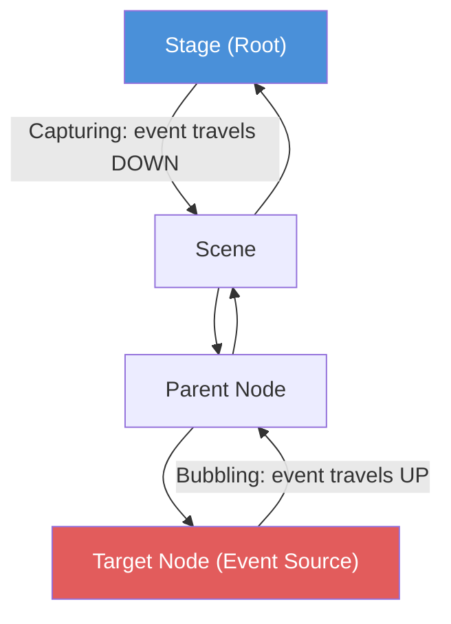

# Session 10 - Course Textbooks, Events in Graphics and UI Design Principles

**Session Date:** 08/09/26

**Entry Date:** 10/09/26

---

## Session Content

Session 10 opened with something I had been curious about since the start: a proper overview of the five books prescribed for this course and what each one actually covers. The professor walked through the reading plan so the class could understand which book to pick up for which topic rather than bouncing between them randomly. From there, the session moved into the Core Java Volume I chapters that are directly relevant to us. Chapter 7 covers exceptions, assertions, and logging. Exceptions are how Java signals that something went wrong at runtime: you throw them, you catch them, and you handle them before they crash the program. Chapter 8 is generic programming, which is how you write code that works across different types while keeping compile-time safety. The angle bracket syntax you see in things like ArrayList<String> comes from generics. Chapter 9 is the Java Collections Framework, which is the toolbox of ready-made data structures: lists, sets, queues, and maps. The professor also covered view-only access in the context of data structures: sometimes you want to let other parts of the code see your data but not change it, and Java supports this through unmodifiable wrappers that throw an exception if anyone tries to modify them.

The session then went into events in computer graphics, which is where things got genuinely hard to follow for me. Every user interaction, a mouse click, a key press, a scroll, generates an event. In JavaFX, events do not just jump directly to their target. They travel through the scene graph in two phases: first down from the root to the target node (capturing), and then back up from the target to the root (bubbling). Event filters intercept on the way down; event handlers respond on the way up. Understanding this hierarchy matters once your GUI gets complex and interactions need to propagate correctly across nested components. The professor explained that this model is what makes advanced GUIs possible: without a proper event hierarchy, every interaction would have to be wired manually and things would quickly become unmanageable.

The blue node is the root where the event enters the scene graph. The red node is the target where the interaction actually happened. Capturing goes top to bottom. Bubbling reverses it back to the root. Filters registered along the path intercept during the downward phase. Handlers respond during the upward phase.

After events, the session covered CSS layouts and grids. The practical point here was about what happens when a window gets resized, shrunk, or stretched. A good layout should reorganize itself to fit the new space rather than overflow or break. Layout containers in JavaFX like GridPane, VBox, and HBox are designed around this: they control how their child components arrange themselves and respond to the available space dynamically. From there the session went into UI components and what distinguishes them from each other in terms of design intent. Checkboxes and radio buttons look similar but serve completely different purposes: a checkbox is for independent binary choices, while a radio button is for mutually exclusive selection within a group. Sliders are used in situations where approximation matters more than precision: when you adjust volume on your phone, you do not need to know it is at exactly 67%, you need it to sound right. Dialog boxes exist specifically to block the user's attention and force a response before the application does something significant.

The last part of the session covered Groups 9 through 12. Group 9 is building a JavaFX UI that mixes Swing and JavaFX components. Group 10 is implementing a Master-Detail Layout: when a user clicks on an item, a listener fires and shows that item's details in a separate panel. The professor used a sharp analogy here: a library website with ten million articles does not and should not load all of them at once. You show a few, and the rest are accessible through search. That is the principle behind Master-Detail and it is a very common pattern in real interfaces. Group 11 is building a UI to style a single geometric object in real time, using controls like sliders and color pickers to let the user adjust properties and see the changes immediately on screen. Group 12 is the most technically interesting to me: a JavaFX program where a button in the UI can directly modify a browser DOM object through JavaFX's built-in WebView and WebEngine, which embeds a real browser inside the JavaFX application.

## What Else I Remember

The professor made a point that is worth noting outside of the technical content. He mentioned that class participation, paying attention during sessions, assigned reading, and take-home activities all carry equal weight in this course. Strong assignment output alone does not compensate for disengagement with the learning process itself. The expectation is proactive involvement across all of it, not selective effort in the parts that feel most familiar.

## What I Understood Well

View-only access connected immediately for me because of Data Structures and Algorithms. In DSA we think about read operations versus write operations as separate concerns all the time. Java's unmodifiable wrappers are a concrete implementation of that idea: you expose the data through a view that allows reading but throws an exception the moment anyone tries to modify it. That is not just a library feature, it is a design pattern for keeping shared state safe.

CSS layouts and grids also clicked well. The idea that a layout should respond to window size rather than break is intuitive once you have tried to build anything for a screen that is not a fixed size. GridPane and VBox are doing this automatically.

The UI components discussion connected strongly to CSE519 Human Computer Interaction. Checkboxes, radio buttons, sliders, and dialog boxes are not just widgets. In HCI terms they are affordances: each one signals a different kind of interaction to the user before they even read a label. A checkbox affords independent multi-selection. A radio button affords single selection from a set. A slider affords continuous adjustment without needing to know the exact value. A dialog box affords forced attention. Understanding why each one exists comes from understanding user mental models, which HCI is entirely about.

## What I Found Challenging

Events in computer graphics were the hardest part of this session for me. I had used event listeners before in Java without much difficulty, but that was always in a flat context: a button fires an event, a handler responds. The scene graph model in JavaFX is different. Events travel through a hierarchy in two phases, and you need to understand whether to use a filter or a handler, which phase each operates in, and what happens when a node consumes an event and stops it from continuing through the chain. In a complex nested UI where multiple components overlap or contain each other, getting this wrong means events are processed in the wrong order or not processed at all. The concept is clear enough in theory but I can see it being the kind of thing that only fully clicks when you are in the middle of debugging a UI that is not behaving the way you expected.

## Connections to Prior Sessions

The Java Collections Framework discussion connects to Session 9's Stack versus Queue topic. In that session those two structures came up as standalone concepts for managing drawing history. Now I can see where they sit in the broader framework: Queue is one of the three main branches under Collection, and Stack is a legacy class built on Vector, which is itself a legacy List implementation. The context makes the earlier discussion feel more grounded. The event hierarchy also connects back to Session 8, where we used a mouse listener to draw arrows between circles on a canvas. At the time I understood that something was listening for mouse input and responding. Now I understand the formal structure behind it: the mouse click generates a MouseEvent, it travels through the scene graph in two phases, and the handler registered on the relevant node picks it up during the bubbling phase.

## Real-World Applications Explored

Sliders on video streaming platforms are the clearest everyday example of the design principle the professor described. YouTube, Prime Video, and most other OTT platforms use sliders for volume control and playback seeking, not because they could not show a number, but because users do not need to know the exact number. You want it louder or softer, earlier or later in the video. The approximation is the whole point. Forcing a precise number input there would be the wrong tool for the job. Dialog boxes show up in the same space: every streaming service uses them for confirmation prompts before cancelling a subscription or deleting an account, because those are moments where blocking the user's attention and forcing a deliberate response is exactly the right interaction design choice. Master-Detail is everywhere too: Gmail's layout of email list on the left and full email on the right is a Master-Detail pattern, and so is Outlook's, and most file managers.

## Insights

Group 12's project is what I keep thinking about. A JavaFX button that modifies a browser DOM through an embedded WebView is essentially a stripped-down version of how browser extensions work. Extensions like uBlock Origin or dark mode tools inject JavaScript into a running webpage and modify its DOM from outside the page itself. That is the same mechanism: an external program reaching into the browser's document model and changing it. I had never thought about extensions as a UI programming concept before, but seeing it framed as a JavaFX project made the underlying idea suddenly very clear. The things I install and use every day in my browser are doing this same bridge between an external process and the DOM.

## Self-Study & Resources Consulted

- **[GeeksforGeeks - Java Collections Tutorial](https://www.geeksforgeeks.org/java/java-collection-tutorial/)**: A comprehensive walkthrough of the Collections Framework hierarchy from the Iterable root through List, Set, Queue, and Map, with implementation classes and guidance on when to use each one.

- **[Oracle JavaFX - Processing Events (Release 8)](https://docs.oracle.com/javase/8/javafx/events-tutorial/processing.htm)**: The official JavaFX documentation on event delivery, covering the scene graph route, capturing and bubbling phases, event filters, and event consumption with concrete examples.

- **[Nielsen Norman Group - Checkboxes vs Radio Buttons](https://www.nngroup.com/articles/checkboxes-vs-radio-buttons/)**: A UX research-backed explanation of the fundamental difference between the two components and the design principles that determine when to use one over the other.

## Key Takeaways

1. Java Collections Framework gives you a structured hierarchy of data structures: Iterable at the root, Collection branching into List, Set, and Queue, with Map as a separate branch for key-value storage.
2. View-only access through unmodifiable wrappers is a concrete implementation of separating read and write concerns, something that comes up in DSA but has a direct Java library equivalent.
3. JavaFX events travel through two phases across the scene graph: capturing (root to target, filters intercept) and bubbling (target to root, handlers respond). Getting the model wrong in a complex UI causes events to fire in the wrong order or not at all.
4. Sliders are the right UI component when approximation matters more than precision. Volume control, brightness, and playback position are all cases where users want a feel for the value, not an exact number.
5. Checkboxes, radio buttons, sliders, and dialog boxes are not just widgets. Each one is a designed affordance that signals a different kind of interaction to the user before they read a single word of the interface.

---
