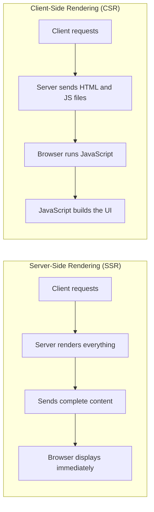

# Session 11 - Moving to Image Processing, Statistics, Rendering and Storage

**Session Date:** 10/09/26

**Entry Date:** 12/09/26

---

## Session Content

Session 11 marked a shift in the course. The professor announced that we are now beginning to transition from computer graphics into image processing, which is the second half of what CSC360 covers. It was a good moment to pause and see where we are in the bigger picture: the first half was about generating images from code, and the second half is about working with images that already exist and extracting meaning or making improvements to them. Before getting into image processing concepts directly, the professor walked through the table of contents for Core Java Volume II, which is the next book in the reading plan. It has chapters on streams, networking, database connectivity, and concurrency, among other topics, giving a sense of the more advanced Java terrain the course is heading into.

From there the session moved into a comparison that connected streaming technology directly to the statistics we then discussed. The professor drew a clear distinction between downloading a video and streaming one. When you download, the entire file arrives first and then playback starts: quality is consistent because you have everything. Streaming is fundamentally different: the content arrives in chunks, playback starts almost immediately, but how good the experience is depends entirely on how reliably those chunks arrive. This is where variance comes in. If the time between packet arrivals is consistent (low variance), the buffer stays full and the video plays smoothly. If the delivery is erratic (high variance), the buffer empties before the next chunk arrives and you get buffering or a quality drop. The professor made the point that bad streaming is not always about slow average speed: it is about inconsistent delivery, and variance is the measure that captures that inconsistency.

The session then covered two topics that surprised me with how directly they connect to each other: XML and vector graphics, and computer networks and graphics. SVG, which stands for Scalable Vector Graphics, is an XML-based format. A vector graphic stored as an SVG file is literally an XML text document: it contains tags like circle and rect with attributes for position, size, and color, and a browser or renderer reads those tags and draws the shapes on screen. This is the exact same principle we discussed in Session 1 when the professor introduced the idea of lines and curves being described mathematically rather than stored as pixels. XML is just the file format that carries those mathematical descriptions. The network connection is a natural extension of this: when a browser requests an SVG from a server, the server sends the XML file and the client's browser does the rendering. That question of who does the work, the server or the client, is what leads to the SSR versus CSR discussion.

Server-Side Rendering means the server processes and renders everything before sending the result to the client. The client receives complete, ready-to-display content. Client-Side Rendering means the server sends raw files, typically HTML with JavaScript, and the client's machine does the rendering work locally. The diagram below shows the difference:



SSR has a faster first load and is better for SEO because the content is already rendered when it arrives. CSR has a slower first load but faster subsequent interactions because once the JavaScript is running, it can update the UI without round-tripping to the server. The right choice depends on the use case: content-heavy sites lean toward SSR, interactive applications lean toward CSR.

The session closed with two more topics. The first was how graphics are stored in databases. For small numbers of small images, a traditional relational database works fine, often storing the image as binary data or storing a file path pointing to where the image lives on disk. For applications that handle large volumes of high-resolution images, object storage systems like Amazon S3 and Google Cloud Storage are the standard. They are designed for storing and retrieving large files at scale, with high availability and cost-effective pricing that a relational database cannot match. The second was AWT. The professor explained why it is called the Abstract Window Toolkit: AWT provides a programming interface that abstracts over the native windowing system of each operating system. When you create an AWT button in Java, AWT delegates to the OS to actually render it as a native button. On Windows it looks like a Windows button. On macOS it looks like a macOS button. The "abstract" part is the Java layer that hides those OS-specific details from the programmer.

## What Else I Remember

The XML and vector graphics connection is worth spelling out a little more explicitly. XML is a general-purpose markup language for describing structured data. SVG borrows that structure and uses it specifically for graphics: shapes become elements, their properties become attributes, and the whole drawing is a document tree. Because SVG is plain text, it can be transmitted over a network like any other file, stored in version control, indexed by search engines, and edited in a text editor. None of that is possible with a raster image. This is one reason SVG became the dominant format for icons, logos, and UI graphics on the web.

## Mathematical Concepts

The statistics discussion introduced four key concepts and their formulas. All formulas below use clean ASCII notation to avoid encoding issues.

**Mean**

The mean is the average. There are two versions depending on whether you are working with an entire population or a sample drawn from it.

```
Population Mean:  mu  = (x1 + x2 + ... + xN) / N
Sample Mean:      x   = (x1 + x2 + ... + xn) / n
```

The distinction matters because a sample is only a subset of the full population. Using the same formula for both is fine for the mean, but it matters for variance.

**Mode**

The mode is the value that appears most frequently in a dataset. A dataset can have one mode (unimodal), more than one mode (multimodal), or no mode at all if every value appears equally often.

**Median**

The median is the middle value when a dataset is arranged in sorted order. It splits the dataset into two equal halves.

```
If n is odd:   Median = value at position ( (n + 1) / 2 ) in sorted order
If n is even:  Median = average of values at positions ( n/2 ) and ( n/2 + 1 ) in sorted order
```

For example, in the dataset [3, 7, 7, 9, 12], the median is 7 (the middle value). In [3, 7, 9, 12], the median is (7 + 9) / 2 = 8. The median is often a better measure than the mean when a dataset has extreme outliers, because outliers shift the mean significantly but do not affect the median.

**Variance**

Variance measures how spread out the values are from the mean. High variance means the values are scattered widely. Low variance means they cluster close to the mean.

```
Population Variance:  sigma^2 = sum( (xi - mu)^2 ) / N
Sample Variance:      s^2     = sum( (xi - x)^2  ) / (n - 1)
```

The sample variance divides by (n - 1) rather than n. This is called Bessel's correction and it compensates for the fact that a sample mean is already the best estimate of the population mean, which introduces a slight underestimate in the variance if you divide by n.

**Standard Deviation**

Standard deviation is the square root of variance. It puts the spread back into the same units as the original data, making it easier to interpret.

```
Population SD:  sigma = sqrt(sigma^2)
Sample SD:      s     = sqrt(s^2)
```

In the context of streaming: a high standard deviation in packet delivery times means the network is inconsistent. Even if the average delivery speed is fast, high variability causes buffering because the buffer empties unpredictably between chunks.

## Code / Implementation Done

This session is where the actual project work for my group (Group 7) began. The task assigned to us was to write a JavaFX program with a tree of objects where each object is editable. After discussing it with the group, we decided what we are building: Taskwood.

Taskwood is a local-first JavaFX desktop application that organises personal and academic work into a three-level navigable tree. Workspaces contain Projects, and Projects contain Tasks. Every node in the tree, whether a Workspace, a Project, or a Task, is fully editable through a dedicated form panel that opens when you select it. All data is automatically persisted to a local JSON file and reloaded when the application starts the next time, so nothing is ever lost between sessions.

This session's contribution was planning: deciding the concept, naming it, and agreeing on the structure. The three-level hierarchy (Workspaces → Projects → Tasks) maps directly to the tree-of-objects requirement. The local JSON persistence satisfies the editing and saving requirement. The form panel satisfies the editing interface requirement. Building this will pull together almost everything the course has covered on the graphics side: JavaFX components, layout containers, event listeners, and data persistence.

## What I Understood Well

SSR versus CSR clicked immediately once the professor framed it as a question of where the work happens. If the server does the rendering, the client gets a finished product but the server carries the load. If the client does the rendering, the server's job is simpler but every client machine pays the cost of building the UI locally. Once that framing was in place, the trade-offs all follow logically rather than feeling like a list to memorise.

| Factor | SSR (Server-Side Rendering) | CSR (Client-Side Rendering) |
|---|---|---|
| First-load speed | Faster - browser gets complete HTML immediately | Slower - browser must download and run JS first |
| SEO | Better - content is pre-rendered and crawlable | Weaker - search engines may not execute JS |
| Server costs | Higher - server renders every request | Lower - server only sends static files |
| Interactivity | Lower - page reloads needed for updates | Higher - JS updates the UI without reloading |
| Subsequent navigation | Slower - each page requires a new server render | Faster - JS handles page transitions locally |
| Best suited for | Content sites, news, landing pages | Web apps, dashboards, interactive tools |

## What I Found Challenging

The database storage discussion for graphics was the part I had the least experience with. I have worked with relational databases through DBMS (CSE250) and understand how tables and queries work. But object storage systems like Amazon S3 and Google Cloud Storage are something I have never used or configured. The concept of storing files as "objects" with metadata, rather than as rows in a table or files on a local disk, required more mental adjustment than I expected. I understand the use case now (scale, cost, redundancy for large files) but actually working with an S3 bucket is something I have not done yet.

## Connections to Prior Sessions

The SVG discussion connects most directly to Session 2, where we first covered the difference between raster and vector graphics. Back then it was a conceptual distinction: raster stores pixels, vector stores mathematical descriptions of shapes. Today we saw what that actually looks like in a file. An SVG file is just an XML document with tags like circle and rect describing positions and sizes. That is the mathematical description from Session 2 written out in a real format.

The SSR versus CSR discussion also connects back to Session 9's headless systems topic. A headless server is a machine with no physical display that processes everything remotely. SSR is exactly what those servers do: they handle the rendering and send the finished result to the client. The two concepts are pointing at the same thing from different angles, one from the hardware side and one from the software side.

## Real-World Applications Explored

The variance and streaming connection has a very direct parallel in competitive online gaming. In games like Valorant or CS2, your "ping" is the average round-trip time to the server, but what actually causes visible lag and rubberbanding is jitter, which is the variance in that ping. A consistent 60ms connection feels smoother than an inconsistent connection that averages 30ms but spikes to 80ms randomly. The statistics from this session are literally the math behind network quality metrics that every competitive player talks about without knowing the formal vocabulary.

## Insights

The networks and graphics connection was the moment that stood out most for me. In CSE330 Computer Networks (4th semester), I studied packet transmission, TCP/IP, latency, and bandwidth as abstract networking concepts. In this session, the professor showed exactly where those concepts land in a graphics context: the variance in packet delivery is what causes streaming quality to degrade, the distinction between who does the rendering (server or client) is a networking architecture decision, and storing graphics remotely on S3 is a distributed systems concern. Every networking concept I studied in CSE330 has a direct application here. The two courses were never framed as related, but they clearly are, and seeing that connection made both of them feel more grounded.

## Self-Study & Resources Consulted

- **[freeCodeCamp - Client Side Rendering and Server Side Rendering Explained](https://www.freecodecamp.org/news/what-exactly-is-client-side-rendering-and-hows-it-different-from-server-side-rendering-bd5c786b340d/)**: A clear and concise breakdown of what SSR and CSR are, how they differ, and the trade-offs that determine when to use each one.

- **[W3Schools - SVG Tutorial](https://www.w3schools.com/graphics/svg_intro.asp)**: A hands-on introduction to SVG as an XML-based format for describing two-dimensional vector graphics, showing how tags like circle and rect describe shapes in plain text.

- **[GeeksforGeeks - Mean, Median, Mode, Variance](https://www.geeksforgeeks.org/mathematics/mean-median-mode/)**: A clean reference for the core statistical measures discussed in this session, including sample versus population formulas and worked examples.

## Key Takeaways

1. The course is now transitioning to image processing. Graphics was about generating images from code; image processing is about working with images that already exist.
2. Variance, not just mean speed, determines streaming quality. Inconsistent packet delivery times cause buffering even when average network speed is fast.
3. SVG is an XML-based vector graphics format: shapes are described as plain-text XML elements, not pixel grids. This is why SVG files are lightweight, scalable, and transmittable over a network like any other document.
4. SSR does the rendering on the server and sends complete content; CSR sends raw files and lets the client's machine build the UI. The right choice depends on whether you prioritise fast first load (SSR) or fast subsequent interactions (CSR).
5. For large-scale graphics storage, object storage systems like Amazon S3 are the standard, not relational databases. They are designed for the scale, redundancy, and cost profile that large file storage requires.

---