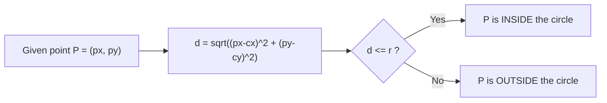

# Session 8 - Group Projects, Linear Algebra and Drawing Geometry in JavaFX

**Session Date:** 01/09/26

**Entry Date:** 02/09/26

---

## Session Content

Session 8 opened with the announcement and overview of the group projects allotted to different groups. By the end of class, four group projects had been discussed and an overview was given for each project by the faculty. Group 1 is building a JavaFX program to draw triangles by inserting three linear equations as text input. Group 2 is drawing circles on a canvas using right-click and connecting them with arrows. Group 3 is implementing a binary tree visualisation. Group 4 is writing a Java program to print an ASCII tree. The professor gave a brief overview of the core idea behind each project and some initial guidance on direction. The GitHub setup instruction was short: each group creates a shared repository and adds all team members as collaborators so everyone can contribute and track changes from the start.

From there the session shifted into a revisit of linear algebra, which I had not touched in depth since my second semester. The reason for revisiting it was clear once the professor connected it to the Group 1 project: a linear equation of the form ax + by = c represents a straight line in 2D space. Two equations represent two lines, and their solution is the point where those lines intersect. Three equations define three lines, and together those three lines form a triangle. The professor walked through an example using 2x + 3y = 5 and 3x + 2y = 6 to introduce row vectors and column vectors. A row vector is a horizontal arrangement of values like [2, 3], representing the coefficients. A column vector is vertical and represents the variables. The determinant of the coefficient matrix tells you whether the system has a unique solution, meaning whether the lines intersect at exactly one point.

The geometry part of the session focused on two things. The first was the distance formula: given two points on a canvas, how do you compute the straight-line distance between them? The proof comes directly from the Pythagorean theorem. The horizontal distance between the points forms one leg of a right triangle, the vertical distance forms another, and the straight-line distance is the hypotenuse. The formula that results is the standard distance formula. The second was a direct application of that formula: given a circle with a known center and radius, how do you check whether a randomly chosen point is inside that circle or outside it? You compute the distance from the point to the center, and if it is less than or equal to the radius, the point is inside.

The session closed with a discussion on Stack versus Queue in the context of erasing drawn objects, and a look at how to draw arrows in JavaFX using mouse events. Clicking and holding the mouse starts the arrow from a source point, and releasing places the endpoint. The mouse listener handles the drag in real time, translating the held click into a live preview of the arrow being drawn.

## What Else I Remember

There was also discussion around how Maven helps with numerical computing. From what I understood and looked up, the main advantage is that Maven makes it trivial to bring in heavyweight math libraries like Apache Commons Math, EJML, or ND4J by simply declaring them as dependencies in pom.xml. Maven then downloads the correct version from the Central Repository and ensures it stays consistent across every developer's machine. Without Maven, adding a numerical library to a Java project would mean manually downloading JAR files, placing them correctly, and managing version conflicts by hand. In a project that depends on multiple math libraries simultaneously, that quickly becomes unmanageable. Maven removes that friction entirely.

## Mathematical Concepts

**Linear Equations and Systems**

A linear equation in two variables takes the general form:

```
ax + by = c
```

Each such equation represents a line in 2D space. A system of two equations, such as:

```
2x + 3y = 5
3x + 2y = 6
```

represents two intersecting lines. In vector notation, the left-hand side of each equation can be written as the dot product of a row coefficient vector and a column variable vector:

```
[2  3] * [x]  =  5
          [y]
```

The determinant of the 2x2 coefficient matrix determines whether the system has a unique solution:

```
| 2  3 |
| 3  2 |  =  (2*2) - (3*3)  =  4 - 9  =  -5
```

A non-zero determinant means the two lines intersect at exactly one point. Three such equations together define three lines, and those three lines form a triangle.

---

**Distance Formula: Proof from Pythagorean Theorem**

Given two points (x1, y1) and (x2, y2), the distance between them is:

```
d = sqrt( (x2 - x1)^2 + (y2 - y1)^2 )
```

The proof uses the Pythagorean theorem. The two points and the axis-aligned intermediate point form a right triangle:

```
(x2, y2)
    *
    |
    |  (y2 - y1)   <- vertical leg
    |
    *------------
(x1, y1)  (x2 - x1)  <- horizontal leg
```

By the Pythagorean theorem: a^2 + b^2 = c^2, where a = (x2 - x1), b = (y2 - y1), and c is the hypotenuse, which is the straight-line distance. Taking the square root gives the distance formula directly.

---

**Checking Whether a Point is Inside a Circle**

Given a circle with center (cx, cy) and radius r, and a test point P at (px, py):



The check is a direct application of the distance formula: compute the distance from P to the center, then compare it to the radius.

## What I Understood Well

The Stack versus Queue discussion was the clearest part of this session. A Stack is LIFO, meaning the last object drawn is the first one erased. A Queue is FIFO, meaning the oldest object would be erased first. In a drawing application where a user expects undo to remove the most recent action, a Stack matches that expectation exactly while a Queue does the opposite. Once that framing was in place, the choice was obvious without needing to think further. The point-in-circle check also clicked immediately: it is just a comparison between two distances, the one you compute and the one you already know (the radius).

## What I Found Challenging

Nothing in this session was technically difficult, but the linear algebra revisit required the most effort. I had studied systems of linear equations, determinants, and row and column vectors in my second semester, but pulling those concepts back from memory after multiple semesters of other coursework was genuinely slow going at first. Once the professor connected the equations to a visual on the canvas, specifically showing that each equation is a line and three lines form a triangle, the recall accelerated. The visual connection was what triggered the memory, not the abstract algebra.

## Connections to Prior Sessions

The distance formula and point-in-circle check connect to Session 4's discussion on the centroid formula for drawing a square. In Session 4, the core idea was using a reference point and a known measurement to determine the positions of other points relative to it. Here, the same approach applies: given a center and a radius, you use the distance formula to decide the spatial relationship between any point and the circle. Both are examples of deriving geometric facts from a reference point using basic coordinate arithmetic. The Maven discussion also connects back to Sessions 6 and 7, where Maven was introduced as the build orchestration tool and the dependency manager. Adding numerical libraries is just another application of the dependency management we already saw at work with pom.xml.

## Real-World Applications Explored

The point-in-circle check is one of the most commonly used operations in interactive software. In game engines, checking whether a projectile's position is inside a circular hitbox uses exactly this computation: if the distance from the projectile to the hitbox center is less than or equal to the radius, it registers as a hit. Engines run thousands of such checks per frame, which is why precision and speed both matter. Drawing applications like Figma, Photoshop, and Illustrator all use a Stack for undo history for exactly the reason discussed in class: users expect the most recent action to be the first one reversed.

## Insights

The mouse listener discussion for arrow drawing made me think about something that sits outside this course but was hard to ignore. Clicking and holding to drag an arrow from one point to another is the same kind of real-time mouse event handling that games depend on at a much higher frequency. In an esport title, the difference between winning and losing a moment can come down to a few milliseconds of input latency between the mouse listener firing and the action appearing on screen. The mechanism is the same: a function listening for mouse state, many times per second, translating input into output. What differs is the stakes attached to how fast and accurately that listener responds. I am not sure how precisely this maps to what we covered today, but I could not stop thinking about it once the arrow drawing discussion started where the function tracks the cursor for building an arrow.

## Self-Study & Resources Consulted

- **[Math LibreTexts - Systems of Equations: Geometry](<https://math.libretexts.org/Bookshelves/Linear_Algebra/A_First_Course_in_Linear_Algebra_(Kuttler)/01:_Systems_of_Equations/1.01:_Geometry>)**: A clear geometric interpretation of linear equations as lines in 2D space, explaining how two equations produce an intersection point and how the solution set changes based on the relationship between the lines.

- **[GeeksforGeeks - Difference Between Stack and Queue Data Structures](https://www.geeksforgeeks.org/dsa/difference-between-stack-and-queue-data-structures/)**: A clean comparison of LIFO and FIFO principles with practical examples, directly relevant to why Stack is the correct structure for managing undo operations in a drawing application.

- **[Oracle JavaFX Documentation - Handling Events](https://docs.oracle.com/javafx/2/events/jfxpub-events.htm)**: The official JavaFX guide on event handling, including mouse click, drag, and release events, which is the mechanism behind the arrow drawing feature discussed in this session.

## Key Takeaways

1. Three linear equations of the form ax + by = c each represent a line in 2D space. Together they can define the three sides of a triangle, which is the mathematical foundation behind Group 1's project.
2. The distance formula d = sqrt((x2-x1)^2 + (y2-y1)^2) is derived from the Pythagorean theorem. Applied to a circle, it lets you determine whether any given point on the canvas falls inside or outside the shape.
3. Stack (LIFO) is the correct data structure for managing drawing history because it erases objects in reverse order of creation, which matches the natural expectation of how undo works.
4. Row and column vectors are not just abstract algebra: they represent the coefficients and variables in a linear system, and the dot product of the two gives the left-hand side of the equation.
5. Mouse listener functions in JavaFX handle real-time input by tracking click, drag, and release states, and this is the mechanism behind any interactive drawing tool where user gestures translate directly into shapes on screen.

---
