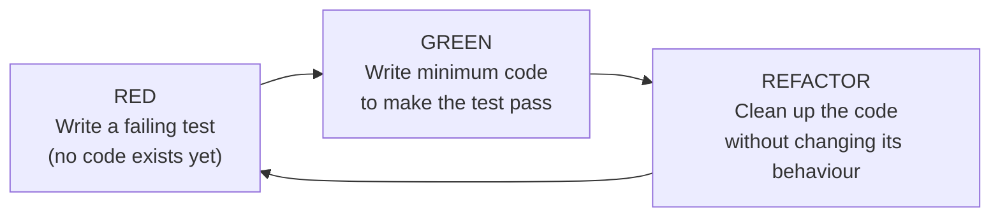

# Session 9 - Group Projects Discussion, Headless Systems and Test-Driven Development

**Session Date:** 03/09/26

**Entry Date:** 08/09/26

---

## Session Content

Session 9 continued the group project discussions from Session 8 and covered Groups 4 through 8 in detail. Group 4 is building a Java program to print an ASCII tree. Group 5 is drawing arrows that connect common elements between two separate lists. Group 6 is creating a splash screen with a logo, animation, sound, and version display. Group 7, which is my group, is implementing a tree of objects where each object is editable and its state is saved to disk so it persists between sessions. Group 8 is handling thread management: running multiple concurrent processes, tracking their states, and supporting graceful cancellation rather than force-stopping them.

One distinction the professor clarified early, which is important for Group 4 specifically, is the difference between printing and drawing. When we say "print an ASCII tree," we mean actual text characters arranged in a terminal to visually suggest a tree shape. Not graphical canvas rendering in JavaFX. Printing outputs characters to a console or text stream. Drawing renders pixels on a display surface. These require completely different tools and approaches in code, and conflating them means building the wrong thing entirely. To help visualise tree structures before writing any code, the professor had us draw a tree on pen and paper first. It sounds like a small step, but having a physical sketch of the hierarchy in front of you makes the structure far easier to reason about than starting from a blank editor.

The next major topic was headless systems. A headless computer is one running without a monitor, keyboard, or mouse. There is no display and no local physical interface. These are not unusual setups: the vast majority of servers in the world are headless. Cloud servers, CI/CD build machines, Raspberry Pi units tucked into server racks, all of these run headlessly by design. The professor made the point that terminals are more powerful than GUIs for managing these systems, not because GUIs are bad, but because command-line access supports scripting, automation, and remote management in ways a GUI simply cannot match. The practical takeaway was that to connect to a headless remote server, you do not need AnyDesk or TeamViewer. You need SSH keys. The same SSH key setup covered in Sessions 2 and 3 for GitHub authentication is the exact mechanism used to authenticate with any remote machine. The only difference is that the remote host is a server rather than GitHub.

The testing discussion revisited unit and integration testing from Session 7 and introduced something new: Test-Driven Development, or TDD. TDD inverts the usual workflow. Instead of writing code and then writing tests to check it works, TDD requires the test to be written first, before any implementation exists. The cycle is called Red-Green-Refactor. You write a test that must fail because no code exists yet (Red), then write the minimum code needed to make it pass (Green), then clean up the code without changing its behaviour (Refactor). The cycle repeats in short increments.

The professor framed the test not as a verification step but as a specification: you are defining what the code must do before deciding how to do it.

The session closed with the project-specific discussions for Groups 6, 7, and 8. Splash screens are the first thing a user sees when opening an application: a logo, sometimes an animation and sound, and version information. They set the user's first impression and give the application time to finish initialising in the background. My group's project (Group 7) clicked into place for me when the professor described it: think of the left panel in Windows File Explorer. Each node in the tree is an object, clicking one expands it or opens it for editing, and the entire state is saved to disk so nothing is lost between sessions. Group 8's thread management project involves running multiple processes simultaneously, tracking each thread's state, and implementing graceful cancellation, which means signalling a thread to stop at a safe checkpoint rather than terminating it abruptly, which can leave shared resources in an inconsistent state.

## What Else I Remember

AnyDesk and TeamViewer work by streaming a GUI desktop from the remote machine to your local screen. They still require the remote machine to render a graphical environment, which costs system resources. SSH bypasses all of that: it gives you a direct command-line shell on the remote machine with no display layer involved at all. For headless servers that have no display hardware, SSH is not just a convenience, it is the correct tool. No GUI remote desktop solution works on a truly headless machine without significant extra configuration, while SSH works out of the box.

## What I Understood Well

The headless system concept clicked immediately. Once you know that most servers have no monitor attached, the whole SSH workflow makes sense not as a workaround or a developer-specific tool, but as the primary and correct access method for server infrastructure. The print versus draw distinction was also immediately clear: ASCII art is text output shaped to look like something visual, while graphical drawing produces actual pixels on a canvas. They look similar from a distance but are completely different operations under the hood.

## What I Found Challenging

TDD was the part that felt most counterintuitive at first. The Red phase specifically: you are writing a test against code that does not exist yet, running it, and watching it fail. That is the expected and correct outcome, but it feels wrong the first time. The phrase "write a test for code you have not written" does not immediately make sense because testing has always meant verifying something that already exists. The professor's reframing helped: the test is a specification, not a check. You are describing the desired behaviour before implementing it, which forces you to think clearly about what the function should do before thinking about how to write it.

## Connections to Prior Sessions

SSH has appeared across three sessions now: Session 2 introduced it in the context of GitHub authentication, Session 3 covered the key generation setup in detail, and Session 9 shows its broader role as the standard tool for accessing any remote machine, headless or otherwise. The same concept, the same keys, and a much wider set of use cases. The TDD discussion also extends Session 7's introduction of unit and integration testing. Session 7 placed those in the context of CI/CD pipelines, where tests run automatically after every push. Session 9 shows how TDD turns that testing mindset into a development methodology: tests are not just a safety net added after coding, they are the starting point of every feature.

## Real-World Applications Explored

Every major cloud provider, AWS, Google Cloud, Azure, runs on headless servers. When a developer deploys an application or troubleshoots a production issue, they do it through SSH, not through a GUI desktop tool. Headless is not an edge case in professional infrastructure, it is the default. TDD is similarly standard across serious software teams. The discipline of writing tests before code means that by the time a feature ships, it already has verified behaviour documented in the test suite, and any future change that breaks it will be caught immediately. The tree-of-objects project my group is building also has a direct real-world parallel in every file explorer and directory browser ever shipped, from Windows Explorer to macOS Finder to VS Code's file panel on the left. That left-side panel is a tree rendering problem, and it turns out I use one every single day without thinking about it as one.

## Insights

The moment that stuck with me from this session was the description of my group's project. The professor said: think of the left panel in Windows File Explorer. I use that panel constantly, every time I open a file or navigate a directory. I had never thought of it as a tree rendering and editing problem with persistent storage underneath it. The moment it was framed that way, something familiar became something I could actually build from scratch. That shift, from "an interface I use" to "a system I understand well enough to implement," was a genuinely satisfying reframe.

## Self-Study & Resources Consulted

- **[Codecademy - Red, Green, Refactor](https://www.codecademy.com/article/tdd-red-green-refactor)**: A clear walkthrough of the TDD cycle, explaining what each phase means in practice and why the failing test in the Red phase is a deliberate and necessary step rather than a mistake.

- **[TechTarget - What is a headless server?](https://www.techtarget.com/whatis/definition/headless-server)**: A clean definition of headless systems with context on how SSH, RDP, and other protocols are used to manage servers that have no physical display or local interface.

- **[Oracle JavaFX Documentation - Concurrency in JavaFX](https://docs.oracle.com/javafx/2/threads/jfxpub-threads.htm)**: The official JavaFX guide on threading, covering how to run background tasks safely alongside the UI thread, directly relevant to Group 8's thread management project.

## Key Takeaways

1. ASCII printing and graphical drawing are fundamentally different operations. Printing outputs text characters to a console; drawing renders pixels on a canvas. Group 4's ASCII tree and Group 2's canvas arrows are built with completely different tools.
2. Most servers in the world are headless. SSH is the primary and correct tool for accessing and managing them. GUI remote desktop solutions like AnyDesk and TeamViewer require the remote machine to render a graphical environment, which SSH bypasses entirely.
3. TDD inverts the usual development order: write the test first (Red), write the minimum code to pass it (Green), then clean it up (Refactor). The test is a specification written before the implementation, not a check run after it.
4. Graceful thread cancellation signals a thread to stop at a safe checkpoint. Force-stopping a thread mid-execution can leave shared resources in an inconsistent state, causing data corruption or deadlocks.
5. Drawing a tree on paper before writing code is a real design step. A physical sketch of a tree hierarchy makes the structure far easier to reason about than starting from a blank editor and guessing at the shape.

---
